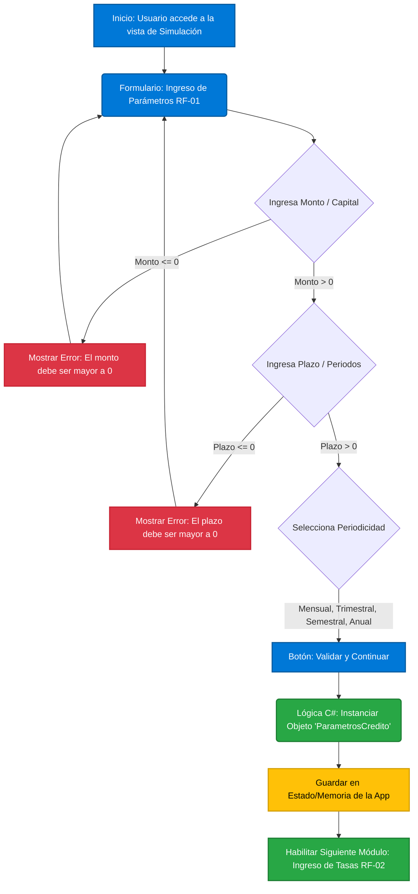

# 📈 EconomicApp - Simulador de Créditos Académico

## 📖 Descripción del Proyecto
**EconomicApp** es un simulador de créditos simplificado diseñado específicamente para la asignatura de Ingeniería Económica. Su objetivo principal es proporcionar una herramienta educativa que permita a los estudiantes modelar préstamos, convertir tasas, calcular capitalizaciones y exportar reportes de amortización. 

A diferencia de los simuladores comerciales tradicionales ("cajas negras"), este software adopta un enfoque pedagógico, permitiendo al usuario interactuar con los parámetros financieros fundamentales para comprender el comportamiento del dinero en el tiempo.

## ✨ Funcionalidades Principales
* **Configuración de Créditos:** Ingreso dinámico de capital, plazos y periodicidad de pagos.
* **Gestión y Conversión de Tasas:** Entrada de tasas Nominales y Efectivas con conversión automática a la tasa efectiva periódica equivalente[cite: 4, 5].
* **Sistemas de Amortización:** Comparación directa entre el Sistema Francés (Cuota Fija) y el Sistema Alemán (Abono Constante).
* **Escenarios Complejos:** Simulación de frecuencias de capitalización y periodos de gracia muertos.
* **Reportes Exportables:** Generación de tablas dinámicas detalladas (cuota, interés, abono a capital y saldo) con opciones de exportación a PDF o Excel/CSV.

## 🛠️ Stack Tecnológico
* **Frontend / UI:** Blazor (WebAssembly/Server) con HTML, CSS y Bootstrap.
* **Backend / Lógica:** C# (.NET).
* **Arquitectura:** Componentes Razor modulares.

## 🚀 Historias de Usuario Principales
* **HU-01:** Parametrización del Préstamo.
* **HU-02:** Equivalencia de Tasas.
* **HU-03:** Visualización de la Tabla de Pagos.
* **HU-04:** Comparativa Francés vs. Alemán.
* **HU-05:** Escenarios de Capitalización.
* **HU-06:** Descarga de Reporte de Amortización.
